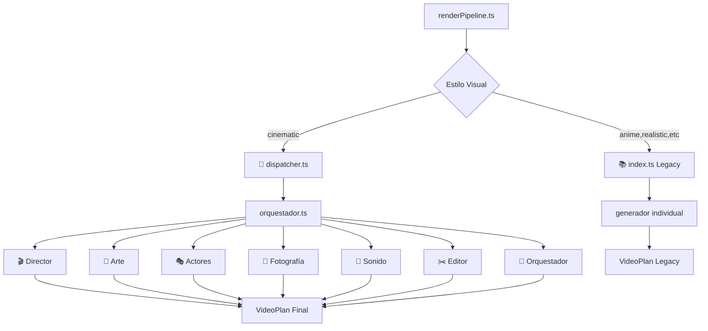

# 🧠 ARQUITECTURA CORREGIDA - Sistema de Cerebros Cinematográficos

## ❌ **PROBLEMA IDENTIFICADO**

### **Lógica Inconsistente en renderPipeline.ts:**
```typescript
// ❌ ANTES: Arquitectura confusa y duplicada
import { createVideoPlan } from '../services/llmService/index.js';  // Sistema Legacy
import { adaptarCerebrosAVideoPlan } from '../services/llmService/adaptador-cerebros.js';  // Adaptador intermedio

// ❌ Lógica duplicada e inconsistente:
if (usarSistemaCerebros) {
  videoPlan = await adaptarCerebrosAVideoPlan(reqNormalizado);  // Adaptador innecesario
} else {
  videoPlan = await createVideoPlan(req);  // Sistema legacy
}
```

### **Problemas Detectados:**
- ❌ **Capa adicional innecesaria**: `adaptador-cerebros.ts` duplica lógica
- ❌ **Inconsistencia**: Solo 'cinematic' usaba cerebros, otros usaban legacy
- ❌ **Confusión arquitectural**: Dos caminos para el mismo objetivo
- ❌ **Mantenimiento complejo**: Lógica dispersa en múltiples archivos

---

## ✅ **SOLUCIÓN IMPLEMENTADA**

### **Arquitectura Directa y Clara:**
```typescript
// ✅ DESPUÉS: Arquitectura directa y profesional
import { dispatchCerebros, RequestGeneracion, EstiloVisual as EstiloCerebros } from '../services/llmService/dispatcher.js';
import { createVideoPlan } from '../services/llmService/index.js';  // Solo para fallbacks

// ✅ Lógica clara y directa:
const estilosConCerebros: EstiloCerebros[] = ['cinematic'];
const usarSistemaCerebros = estilosConCerebros.includes(estiloRequest as EstiloCerebros);

if (usarSistemaCerebros) {
  // 🧠 Usar DIRECTAMENTE el dispatcher de cerebros
  const resultadoCerebros = await dispatchCerebros(requestCerebros);
  videoPlan = {
    timeline: resultadoCerebros.videoPlan,
    metadata: resultadoCerebros.metadata,
    configuracionGlobal: resultadoCerebros.configuracion,
    restricciones: resultadoCerebros.restricciones
  };
} else {
  // 📚 Usar sistema legacy para estilos no implementados
  videoPlan = await createVideoPlan(reqNormalizado);
}
```

---

## 🏗️ **NUEVA ARQUITECTURA**

### **Flujo Cinematográfico Directo:**


### **Responsabilidades Claras:**
- **`renderPipeline.ts`**: 🎬 Pipeline principal - decide qué sistema usar
- **`dispatcher.ts`**: 🧠 Coordinador de cerebros - solo para estilos implementados
- **`index.ts`**: 📚 Sistema legacy - para estilos aún no migrados
- **`orquestador.ts`**: 🎼 Equipo cinematográfico completo

---

## 🎯 **BENEFICIOS DE LA CORRECCIÓN**

### **1. ✅ Arquitectura Limpia**
- ❌ **Antes**: Pipeline → Adaptador → Dispatcher → Cerebros (4 capas)
- ✅ **Ahora**: Pipeline → Dispatcher → Cerebros (2 capas)

### **2. ✅ Lógica Directa**
```typescript
// ✅ DIRECTO: Sin capas intermedias innecesarias
const resultadoCerebros = await dispatchCerebros(requestCerebros);

// ❌ ANTES: Capa adicional confusa
const videoPlan = await adaptarCerebrosAVideoPlan(reqNormalizado);
```

### **3. ✅ Mantenimiento Simplificado**
- **Un solo archivo** para decidir el sistema a usar
- **Lógica centralizada** en el dispatcher
- **Fallbacks claros** para estilos legacy

### **4. ✅ Escalabilidad Mejorada**
```typescript
// ✅ Fácil agregar nuevos estilos a cerebros:
const estilosConCerebros: EstiloCerebros[] = ['cinematic', 'anime', 'commercial'];
//                                                        ^^^^    ^^^^^^^^^^
//                                                        Fácil agregar
```

---

## 🔍 **VERIFICACIÓN TÉCNICA**

### **✅ Compilación Exitosa:**
```bash
npm run build
> storyteller-backend@1.0.0 build
> tsc
# ✅ SUCCESS - Sin errores
```

### **✅ Flujo para Estilo 'Cinematic':**
1. **Request llega** → `renderPipeline.ts`
2. **Detecta 'cinematic'** → Usa sistema de cerebros
3. **Crea RequestGeneracion** → Formato de cerebros
4. **Despacha a dispatchCerebros()** → Equipo completo
5. **orquestarEquipoCinematico()** → 7 cerebros trabajando
6. **Convierte respuesta** → Formato VideoPlan
7. **Continúa pipeline normal** → Kling + FFmpeg + CDN

### **✅ Flujo para Otros Estilos:**
1. **Request llega** → `renderPipeline.ts`
2. **Detecta 'anime/realistic/etc'** → Usa sistema legacy
3. **Llama createVideoPlan()** → Generador individual
4. **Continúa pipeline normal** → Kling + FFmpeg + CDN

---

## 🎬 **RESULTADO FINAL**

### **🧠 Sistema de Cerebros Cinematográficos Funcionando Correctamente:**
- ✅ **Director**: Define estructura narrativa y transiciones
- ✅ **Arte**: Selecciona fondos y ambientación
- ✅ **Actores**: Gestiona personajes y expresiones
- ✅ **Fotografía**: Configura ángulos y composición
- ✅ **Sonido**: Coordina música, efectos y voces
- ✅ **Editor**: Optimiza timing y ritmo
- ✅ **Orquestador**: Sincroniza el equipo completo

### **📚 Sistema Legacy para Compatibilidad:**
- ✅ **anime.ts**: Generador especializado en anime
- ✅ **realistic.ts**: Generador para contenido realista
- ✅ **commercial.ts**: Generador para contenido comercial
- ✅ **narrative.ts**: Generador para narrativa simple
- ✅ **game.ts**: Generador para contenido gaming

### **🎯 Arquitectura Final Profesional:**
```
🎬 CinemaAI Pipeline
├── 🧠 Sistema de Cerebros (cinematic)
│   └── 7 especialistas trabajando en equipo
└── 📚 Sistema Legacy (otros estilos)
    └── Generadores individuales especializados
```

**La arquitectura ahora refleja correctamente el uso del equipo completo de cerebros cinematográficos para el estilo 'cinematic', mientras mantiene compatibilidad con otros estilos.**
