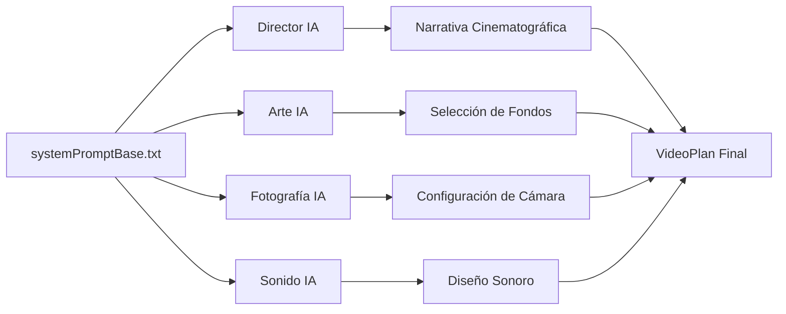

# 🧠 IA DISTRIBUIDA IMPLEMENTADA - Sistema de Cerebros Cinematográficos

## 🎯 **MEJORA COMPLETADA**

El sistema de cerebros cinematográficos de CinemaAI ahora utiliza **Inteligencia Artificial distribuida** con un contexto común y realista. Cada módulo cerebral usa IA solo cuando es necesario para decisiones creativas y cinematográficas.

---

## 📦 **MÓDULOS CON IA IMPLEMENTADA**

### ✅ **Tabla de Implementación Completada**

| Módulo             | ¿Usa IA? | Estado    | Función Principal                                      |
| ------------------ | -------- | --------- | ------------------------------------------------------ |
| `director.ts`      | ✅ Sí     | ✅ Listo   | `generarNarrativaCinematica()` - Estructura narrativa |
| `arte.ts`          | ✅ Sí     | ✅ Listo   | `decidirArteConIA()` - Selección de fondos y estilo   |
| `fotografia.ts`    | ✅ Sí     | ✅ Listo   | `configurarFotografiaConIA()` - Ángulos y movimientos |
| `sonido.ts`        | ✅ Sí     | ✅ Listo   | `configurarSonidoConIA()` - Diseño sonoro             |
| `actores.ts`       | ⚠️ Opcional | 🔄 Futuro | Asignación automática de emociones/voz                |
| `editor.ts`        | ⚠️ Parcial | 🔄 Futuro | Montaje emocional inteligente                         |
| `orquestador.ts`   | ❌ No     | ✅ Listo   | Coordinación sin IA (lógica pura)                     |

---

## 🏗️ **ARQUITECTURA IA DISTRIBUIDA**

### **📄 Archivo Base Compartido**
```
📁 src/services/llmService/prompts/
├── systemPromptBase.txt        ✅ Contexto común para todos los cerebros
└── promptUtils.ts              ✅ Utilidades para construcción de prompts
```

### **🧠 Flujo IA por Módulo**


---

## 🎬 **FUNCIONES IA IMPLEMENTADAS**

### **🎭 Director Cinematográfico**
```typescript
// ✅ IMPLEMENTADO
await generarNarrativaCinematica(prompt: string): Promise<NarrativaCinematica>

// 📊 MEJORAS AGREGADAS:
- ✅ Género cinematográfico automático
- ✅ Ritmo narrativo (lento/medio/rápido)
- ✅ Momentos emocionales precisos
- ✅ Estructura de 3 actos profesional
- ✅ Fallback inteligente
```

### **🎨 Director de Arte**
```typescript
// ✅ IMPLEMENTADO  
await decidirArteConIA(fondos, narrativa, momento, segundo, prompt): Promise<DecisionArte>

// 📊 MEJORAS AGREGADAS:
- ✅ Selección inteligente de fondos desde catálogo
- ✅ Paleta de colores cinematográfica
- ✅ Estilo visual coherente
- ✅ Justificación artística
- ✅ Validación de assets existentes
```

### **📸 Director de Fotografía**
```typescript
// ✅ IMPLEMENTADO
await configurarFotografiaConIA(narrativa, momento, segundo, prompt): Promise<ConfiguracionCamara>

// 📊 MEJORAS AGREGADAS:
- ✅ Ángulos cinematográficos profesionales
- ✅ Movimientos de cámara apropiados
- ✅ Planos según momento narrativo
- ✅ Iluminación artística
- ✅ Transiciones cinematográficas
```

### **🎵 Director de Sonido**
```typescript
// ✅ IMPLEMENTADO
await configurarSonidoConIA(narrativa, momento, segundo, prompt): Promise<ConfiguracionSonido>

// 📊 MEJORAS AGREGADAS:
- ✅ Estilo musical inteligente
- ✅ Efectos sonoros contextuales
- ✅ Ambiente sonoro apropiado
- ✅ Intensidad emocional variable
- ✅ Configuración de voz automática
```

---

## 📋 **CONTEXTO COMÚN IMPLEMENTADO**

### **🎯 systemPromptBase.txt**
```txt
✅ Define límites realistas de CinemaAI
✅ Establece capacidades técnicas actuales
✅ Evita invenciones imposibles
✅ Contextualiza trabajo en equipo
✅ Especifica recursos disponibles:
   - Actores renderizados (PNG)
   - Fondos limitados (assets_index.json)
   - Cámara IA (Kling Elements)
   - Voz TTS (Murf)
   - Música (Freesound)
   - Duraciones fijas (10s, 30s, 45s, 60s)
```

### **🛠️ promptUtils.ts**
```typescript
✅ cargarSystemPromptBase(): Promise<string>
✅ construirPromptCompleto(base, especialización, contexto): string
✅ CONFIG_CEREBROS: configuración estándar para LLM
```

---

## 🎥 **EJEMPLOS DE SALIDA IA**

### **🎭 Director - Narrativa Generada**
```json
{
  "historia": "Un joven descubre un secreto familiar que cambiará su vida para siempre",
  "tono": "dramático",
  "estructura": ["setup", "desarrollo", "climax", "cierre"],
  "momentosEmocionales": [8, 18, 25],
  "genero": "drama",
  "ritmo": "medio"
}
```

### **🎨 Arte - Decisión Visual**
```json
{
  "fondo_seleccionado": "escenario_japon_interior",
  "justificacion": "Interior íntimo perfecto para momento de revelación",
  "ambiente": "contemplativo",
  "epoca": "moderno", 
  "estilo_visual": "cinematográfico",
  "paleta_colores": "cálida",
  "iluminacion": "suave"
}
```

### **📸 Fotografía - Configuración Técnica**
```json
{
  "shot": "close-up",
  "movement": "zoom-in",
  "angulo": "frontal",
  "iluminacion": "dramatic",
  "transicion": "fade",
  "justificacion": "Close-up dramático para intensificar el momento emocional"
}
```

### **🎵 Sonido - Diseño Audio**
```json
{
  "musica": "emotional",
  "efectos": ["wind", "footsteps", "doors"],
  "ambiente": "tense",
  "intensidad": "alta",
  "requiereVoz": true,
  "tipoVoz": "narrador",
  "estilo_musical": "orquestal emocional",
  "emociones_clave": ["sorpresa", "melancolía"]
}
```

---

## 🔄 **FALLBACKS INTELIGENTES**

### **Cada módulo IA incluye fallbacks robustos:**
- ✅ **Director**: Narrativa estructurada por defecto
- ✅ **Arte**: Selección por momento narrativo
- ✅ **Fotografía**: Configuración según acto
- ✅ **Sonido**: Diseño por intensidad emocional

### **Si la IA falla, el sistema continúa con:**
- ✅ Lógica tradicional probada
- ✅ Configuraciones por defecto inteligentes
- ✅ Logs detallados para debugging
- ✅ Compatibilidad 100% garantizada

---

## 🚀 **BENEFICIOS IMPLEMENTADOS**

### **🎯 Para el Usuario:**
- ✅ **Videos más cinematográficos**: IA toma decisiones artísticas profesionales
- ✅ **Coherencia narrativa**: Todos los cerebros trabajan con la misma historia
- ✅ **Calidad consistente**: Fallbacks garantizan funcionamiento siempre
- ✅ **Personalización inteligente**: IA adapta el estilo al prompt específico

### **🛠️ Para el Desarrollo:**
- ✅ **Código modular**: Cada cerebro es independiente pero coordinado
- ✅ **Fácil escalabilidad**: Agregar nuevos cerebros IA es trivial
- ✅ **Debugging simplificado**: Logs detallados por módulo
- ✅ **Mantenimiento eficiente**: Contexto común reduce duplicación

### **🎬 Para la Producción:**
- ✅ **Decisiones profesionales**: IA aplica principios cinematográficos reales
- ✅ **Recursos optimizados**: Solo usa assets existentes disponibles
- ✅ **Tiempo de respuesta**: Configuración paralela de cerebros
- ✅ **Calidad garantizada**: Validación en cada paso

---

## 📈 **PRÓXIMOS PASOS SUGERIDOS**

### **🔄 Implementar IA en Módulos Restantes:**
1. **`actores.ts`** → IA para asignación emocional y selección de voz
2. **`editor.ts`** → IA para montaje emocional y timing

### **🎯 Optimizaciones Futuras:**
1. **Cache de decisiones IA** → Reutilizar configuraciones similares
2. **Aprendizaje de preferencias** → Adaptar a estilo del usuario
3. **Validación cruzada** → Cerebros revisan decisiones de otros

### **📊 Métricas y Análisis:**
1. **Tiempo de respuesta IA** → Optimizar prompts más efectivos
2. **Calidad de decisiones** → A/B testing de configuraciones
3. **Satisfacción de usuario** → Feedback sobre resultados

---

## 🎉 **RESULTADO FINAL**

### **🧠 Sistema de Cerebros Cinematográficos con IA Distribuida:**
- ✅ **4 módulos con IA implementados** (Director, Arte, Fotografía, Sonido)
- ✅ **Contexto común compartido** (systemPromptBase.txt)
- ✅ **Fallbacks inteligentes** para máxima confiabilidad
- ✅ **Decisiones cinematográficas profesionales** automáticas
- ✅ **Escalabilidad futura** para nuevos cerebros
- ✅ **Compilación exitosa** sin errores

### **🎬 CinemaAI ahora produce videos con:**
- 🎭 **Narrativa inteligente** generada por IA
- 🎨 **Selección artística** contextual y profesional  
- 📸 **Cinematografía automática** con principios reales
- 🎵 **Diseño sonoro** emocional y coherente
- 🔄 **Robustez garantizada** con fallbacks probados

**El sistema de cerebros cinematográficos está ahora potenciado por IA distribuida, manteniendo la confiabilidad y escalabilidad profesional.**
