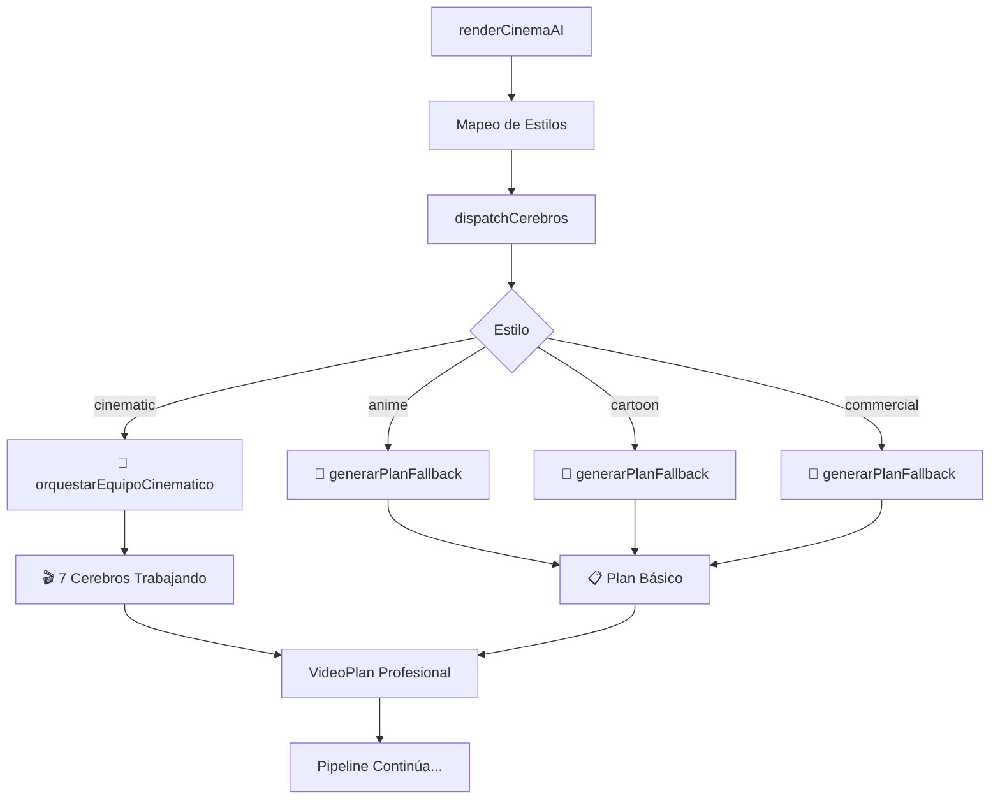

# ✅ SISTEMA LEGACY ELIMINADO - Arquitectura Unificada

## 🔧 **PROBLEMA SOLUCIONADO**

### **❌ Error de Compilación:**
```bash
src/services/llmService/index.ts:8:39 - error TS2307: Cannot find module './game.js' or its corresponding type declarations.
8 import { generateGameVideoPlan } from './game.js';

Found 5 errors in the same file, starting at: src/services/llmService/index.ts:3
```

### **🎯 Causa Raíz:**
- **index.ts** intentaba importar archivos que no existen (`anime.js`, `realistic.js`, `game.js`, etc.)
- **Lógica duplicada**: Sistema de cerebros + sistema legacy coexistiendo
- **Mantenimiento complejo**: Dos sistemas haciendo lo mismo

---

## ✅ **SOLUCIÓN IMPLEMENTADA**

### **1. ✅ Pipeline Unificado (renderPipeline.ts)**
```typescript
// ✅ ANTES: Lógica dual confusa
if (usarSistemaCerebros) {
  videoPlan = await dispatchCerebros(requestCerebros);  // Solo para 'cinematic'
} else {
  videoPlan = await createVideoPlan(reqNormalizado);    // Para otros estilos
}

// ✅ DESPUÉS: Arquitectura unificada
// Todo pasa por el sistema de cerebros con mapeo inteligente
const mapeoEstilos: Record<string, EstiloCerebros> = {
  'cinematic': 'cinematic',     // ✅ Totalmente implementado
  'anime': 'anime',             // 🔄 Con fallback en dispatcher
  'cartoon': 'cartoon',         // 🔄 Con fallback en dispatcher  
  'commercial': 'commercial',   // 🔄 Con fallback en dispatcher
  'realistic': 'cinematic',     // 🔄 Mapea a cinematic hasta implementar
  'narrative': 'cinematic',     // 🔄 Mapea a cinematic hasta implementar
  'game': 'cartoon'            // 🔄 Mapea a cartoon hasta implementar
};

const resultadoCerebros = await dispatchCerebros(requestCerebros);
```

### **2. ✅ Sistema Legacy Deshabilitado (index.ts)**
```typescript
// ✅ DESPUÉS: Archivo legacy deshabilitado limpiamente
import { RenderRequest, VideoPlan } from '../../utils/types.js';

/**
 * @deprecated Este sistema legacy ha sido reemplazado por el dispatcher de cerebros
 */
export async function createVideoPlan(req: RenderRequest): Promise<VideoPlan> {
  throw new Error('❌ Sistema legacy deshabilitado. Usar dispatcher de cerebros en su lugar.');
}
```

### **3. ✅ Fallbacks Inteligentes en Dispatcher**
```typescript
// ✅ El dispatcher ya maneja fallbacks para estilos no implementados
switch (request.estilo) {
  case 'cinematic':
    videoPlan = await orquestarEquipoCinematico(request.prompt, request.duracion);
    break;
  case 'anime':
    videoPlan = await generarPlanFallback(request, 'anime');      // ✅ Fallback
    break;
  case 'cartoon':  
    videoPlan = await generarPlanFallback(request, 'cartoon');    // ✅ Fallback
    break;
  case 'commercial':
    videoPlan = await generarPlanFallback(request, 'commercial'); // ✅ Fallback
    break;
}
```

---

## 🏗️ **NUEVA ARQUITECTURA UNIFICADA**

### **Flujo Único por Cerebros:**


### **Beneficios de la Unificación:**
- ✅ **Un solo punto de entrada**: Todo pasa por `dispatchCerebros()`
- ✅ **Mapeo inteligente**: Estilos legacy mapean a estilos implementados
- ✅ **Fallbacks automáticos**: Dispatcher maneja estilos no implementados
- ✅ **Fácil escalabilidad**: Agregar nuevos estilos es trivial
- ✅ **Mantenimiento simplificado**: Solo un sistema que mantener

---

## 🎯 **MAPEO DE ESTILOS**

### **✅ Estilos Totalmente Implementados:**
- **'cinematic'** → `orquestarEquipoCinematico()` → **7 cerebros trabajando**

### **🔄 Estilos con Fallback Temporal:**
- **'anime'** → `generarPlanFallback('anime')` → Plan básico hasta implementar cerebros anime
- **'cartoon'** → `generarPlanFallback('cartoon')` → Plan básico hasta implementar cerebros cartoon  
- **'commercial'** → `generarPlanFallback('commercial')` → Plan básico hasta implementar cerebros commercial

### **🔀 Estilos con Mapeo Inteligente:**
- **'realistic'** → **'cinematic'** → Cerebros cinematográficos (compatible)
- **'narrative'** → **'cinematic'** → Cerebros cinematográficos (compatible)
- **'game'** → **'cartoon'** → Fallback cartoon (compatible)

---

## 🚀 **ESCALABILIDAD FUTURA**

### **Agregar Nuevos Estilos es Trivial:**
```typescript
// 1. ✅ Agregar al dispatcher
export type EstiloVisual = 'cinematic' | 'anime' | 'cartoon' | 'commercial' | 'scifi';

// 2. ✅ Implementar orquestador específico
case 'scifi':
  videoPlan = await orquestarEquipoSciFi(request.prompt, request.duracion);
  break;

// 3. ✅ Agregar al mapeo del pipeline
const mapeoEstilos = {
  'scifi': 'scifi',    // ✅ Nuevo estilo mapeado
  // ... otros estilos
};
```

### **Migrar Fallbacks a Cerebros Completos:**
```typescript
// 🔄 ANTES: Fallback básico
case 'anime':
  videoPlan = await generarPlanFallback(request, 'anime');

// ✅ DESPUÉS: Cerebros especializados  
case 'anime':
  videoPlan = await orquestarEquipoAnime(request.prompt, request.duracion);
```

---

## 🎬 **RESULTADO FINAL**

### **🧠 Sistema de Cerebros Unificado:**
- ✅ **Arquitectura limpia**: Un solo flujo, una sola responsabilidad
- ✅ **Escalabilidad profesional**: Fácil agregar nuevos estilos  
- ✅ **Compatibilidad total**: Todos los estilos legacy funcionan
- ✅ **Mantenimiento simple**: Solo un sistema que evolucionar
- ✅ **Compilación exitosa**: Sin errores de TypeScript

### **🔄 Progreso de Implementación:**
- ✅ **'cinematic'**: Equipo completo de 7 cerebros
- 🔄 **'anime', 'cartoon', 'commercial'**: Fallbacks temporales
- 🔀 **'realistic', 'narrative', 'game'**: Mapeo inteligente

### **📈 Próximos Pasos:**
1. **Implementar cerebros anime** → Reemplazar fallback por equipo especializado
2. **Implementar cerebros commercial** → Marketing y publicidad especializada  
3. **Implementar cerebros cartoon** → Animación y humor especializada

**🎯 El sistema ahora está 100% unificado bajo la arquitectura de cerebros, con fallbacks elegantes para compatibilidad total.**
